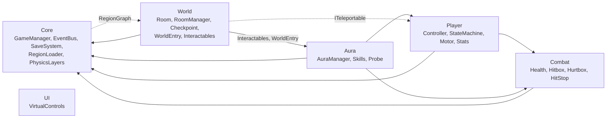

# Kiến trúc hệ thống (Aura Knight)

Mô tả những gì đã có trong code (phase 1-7, 10, 11 và pipeline art). Bosses, Shop/Map: xem tài liệu phase tương ứng khi hoàn tất. Thiết kế: [`game-design-document.md`](game-design-document.md) §12. Quy ước: [`code-standards.md`](code-standards.md).

## 1. Bố cục scene

| Scene | Vai trò |
|-------|---------|
| `Boot` (build index 0) | `Bootstrapper`: đặt 60 fps, chặn tắt màn hình, load `MainMenu` |
| `MainMenu` | Màn hình menu (`MenuScreens`); nút chơi gọi `GameLauncher.Begin` (xem §5) |
| `Core` | Luôn được giữ khi chơi. Camera (Cinemachine + confiner) và object `Managers`: `GameManager`, `CheckpointService`, `RoomManager`, `RegionLoader`, `WorldEntry`. Player là prefab do `WorldEntry` tạo |
| `Region_Hub/Forest/Cave/City/Castle` | Mỗi vùng một scene, load/unload additive bởi `RegionLoader`. Chứa các `Room` và `SunAltar`; hiện mới có phòng khởi đầu greybox do generator sinh |
| `Test/Test_Movement`, `Test_Aura`, `Test_Rooms`, `Test_Enemies` | Scene thử độc lập, sinh bởi generator (`Test_Movement`, `Test_Aura` có `TestCheckpoint` vì hồi sinh không còn "sống lại tại chỗ") |

## 2. Bản đồ module

| Module | Nội dung chính |
|--------|----------------|
| Core | Vòng đời game (`GameManager`, `GameMode`), `GameState` + `SaveSystem` (`ISaveStorage`/`FileSaveStorage`), `EventBus` + `GameEvents`, `RegionLoader`/`SceneLoader`, `PhysicsLayers`, `Singleton`, `Haptics` |
| Player | Máy trạng thái 13 state, `KinematicMotor2D` (di chuyển động học, không dùng physics solver), `PlayerInputReader` (`IPlayerInput`), `PlayerStats` (tim, năng lượng, xu), `PlayerCombat` |
| Combat | `Health`, `Hitbox`/`Hurtbox` theo `Team`, `Knockback`, `HitStop`, i-frame, `EnergyPool` |
| Aura | `AuraManager` (Aura hiện tại, mở khóa, đổi, cast), `AuraDefinition` (SO), `PlayerAuraBinder` (passive vào Player), 3 skill, `AuraInteractionProbe` |
| World | `Room`/`RoomManager`/`RoomExit`, `RegionGraph`, `SunAltar` + `CheckpointService`, `Shortcut`, `WorldEntry`, `Interactables/*`, `Pickups/*` |
| UI | Xem §5: theme, router màn hình, HUD, menu, `VirtualControls`. Chỉ nghe `EventBus` |
| Enemies | Xem §6: 4 archetype + modifier, `EnemyStats`, drop xu |
| Audio | Xem §7: `Sfx.Play`, `AudioManager`, nhạc theo vùng |

Hướng phụ thuộc:
- Tất cả phụ thuộc `Core`; `Core` chỉ biết `World` qua `RegionGraph` (dữ liệu vùng).
- Khung phòng/hồi sinh của World (`Room`, `RoomManager`, `RoomExit`, `CheckpointService`, `AltarArrival`) **không biết `Player`**: chỉ dịch chuyển nhân vật qua `ITeleportable` (`PlayerController` cài đặt).
- Ngoại lệ có chủ đích: `WorldEntry` gọi `PlayerCombat` (reset khi vào game); vài `Interactables` dùng `Aura`/`Combat` (`OxygenMeter`, `HeatVent`) hoặc `Player` (`WindCurrent`, `LavaFreezable`, `LightDropPickup`) vì chúng là cơ quan phản ứng với Leo.
- Giao tiếp ngang giữa các module qua `EventBus`, không gọi trực tiếp. Mọi code runtime nằm chung một assembly nên hướng này là quy ước, không do compiler ép.

## 3. Luồng chạy

### 3.1 Game mới / tiếp tục

1. Menu gọi `WorldEntry.StartNewGame()` hoặc `Continue()`: `GameManager` nạp/tạo `GameState`, publish `GameStateLoaded`, `GameMode = Loading`.
2. `WorldEntry` tra vùng của `lastAltarId` trong `RegionGraph.altarIds`, `RegionLoader.SetCurrentRegion` rồi chờ scene load xong và bàn thờ đăng ký (`FindAltar`). Không tìm được thì dùng bàn thờ Hub.
3. Tạo Player (hoặc dùng lại, gọi `ResetToFreshStart()`), `AltarArrival.Place` (warp + vào phòng), `GameMode = Playing`, publish `Entered`.
4. `PlayerStats`, `AuraManager`, các cổng một lần và `Shortcut` đọc lại state khi nhận `GameStateLoaded`.

### 3.2 Chuyển phòng

`RoomExit` (trigger) → `RoomManager.EnterRoom` → bật phòng mới, đổi confiner Cinemachine (giữ damping `RoomBlendTiming`), tắt phòng cũ sau cùng khoảng trễ đó → ghi `visitedRooms` → publish `RoomEntered` → `RegionLoader` dựa vào `RegionLoadPlan` load vùng kề / unload vùng xa. Mọi lần dời vị trí đi qua `RoomManager.Warp` để camera được báo.

### 3.3 Chết → hồi sinh (có thể khác vùng)

`Health.Died` → `DeadState` giữ yên và gọi `CheckpointService.Respawn()` (coroutine, cờ `respawning`) → tra `lastAltarId`, `WorldEntry.FindAltar` nạp vùng đích nếu cần → `AltarArrival.Place` (warp, vào phòng, `Room.Restart()` nếu là phòng đang đứng) → publish `PlayerRespawned` **chỉ khi đã tới nơi**. Không giải được bàn thờ thì rơi về bàn thờ Hub và thử lại mỗi 1 s; Leo vẫn ở trạng thái Dead.

### 3.4 Đổi Aura / dùng skill

- Input đọc ngay trong `AuraManager` từ `controller.Input`. `TrySwitch`/`TryCycle` bị chặn khi Dead hoặc chưa mở khóa, CD 0.3 s → ghi `GameState` → publish `AuraChanged`.
- `PlayerAuraBinder` nghe `AuraChanged`, `AuraPassiveResolver` tính lại passive (nhảy đúp, lướt, tốc độ, nhảy, bơi) và ghi vào `PlayerController`; `AuraVisuals` đổi màu/glow.
- `TryCastSkill` → kiểm tra Dead/Hurt, CD skill, trừ năng lượng qua `PlayerStats` → `skill.Cast()`. Skill chạm cơ quan bằng `AuraInteractionProbe` → `IAuraInteractable` (cổng, dung nham...).
- Mở Aura mới: `AuraManager.Unlock(id)` ghi state và lưu file ngay, rồi boss mới publish `BossDefeated`.

## 4. Giới hạn đã biết

- `WorldEntry` chưa unload vùng đang load khi bắt đầu game mới lần hai; cổng/shortcut chỉ mở thêm, không đóng lại. Luồng menu nên quay về `Core` mới.
- Pause menu tương lai phải đặt `GameMode.Paused` và khôi phục về `HitStop.GameplayScale`.
- Chưa chạy thử trên thiết bị: rung (`VibrationEffect`), `File.Replace` trên Android IL2CPP (có đường copy dự phòng).

## 5. UI (`Scripts/UI`, namespace `AuraKnight.UI`)

- Nền: `UITheme` (SO token màu/cỡ), `ThemedText/Image/AccentBar`, `UIScreen` (fade + trượt 16 px, bắt đầu inactive, `Show/Hide`), `ScreenStack` (logic thuần) + `UIRouter`, `Localization` (`Strings_vi.json`), `GameSettings` (PlayerPrefs, khóa trong `SettingsKeys`), `PauseController`.
- HUD: `HudController` chỉ hiện khi `GameMode.Playing`; các view (tim, năng lượng, xu, Aura, boss bar) nghe event. `VirtualControls` dựng bởi `VirtualControlsBuilder`.
- Luồng menu → Core: `MainMenuScreen` → (intro) → `GameLauncher.Begin(newGame)` lưu yêu cầu rồi load `Core` (single). `CoreLauncher` (trong `UI_Root` của Core) đọc yêu cầu, gọi `WorldEntry.StartNewGame()`/`Continue()`; lỗi thì quay về menu. Pause → "Về menu" lưu rồi load `MainMenu` (`GameLauncher.ReturnToMenu`).
- Prefab/scene sinh bởi `AuraKnight.Editor.UI` (asmdef riêng, `Scripts/Editor/UI`): `UiGenerator.GenerateAll` (menu `Aura/UI/Generate All`) dựng font, sprite, theme, `Hud`, `GameScreens`, `MenuScreens`, `UI_Root` trong Core, màn trong `MainMenu`.

## 6. Enemies (`Scripts/Enemies`)

- `EnemyBase` (partial) + `WalkerEnemy`, `HopperEnemy`, `FlyerEnemy`, `CrawlerEnemy` (cả zapper tĩnh); modifier `FrontShield`, `PhaseThroughWalls`, `LifeSteal`. Logic thuần: `EnemyStateMachine`, `PatrolRules`, `DiveRules`, `ZapCycle`, `DropTable`.
- Số liệu ở `EnemyStats` (SO, 8 asset trong `Data/Enemies`). Giới hạn 6 enemy/phòng (`EnemyLimits`, validator `EnemyRoomLimitValidator`).
- Quái chết vẫn active nhưng bất động; `EnemyBase.OnEnable`/`ResetEnemy()` reset toàn bộ (phòng bật lại là hồi sinh).
- Id dữ liệu/prefab khác id art ở 3 biến thể (`BugThorn`→`ThornBug`, `PatrolBot`→`PatrolRobot`, `PoisonShroom`→`MushroomHopper`). Bảng ánh xạ duy nhất: `EnemyVariants.All[*].ArtId` (generator), ghi vào `EnemyStats.artId`.
- Xu: `CoinPickup` bị hút trong 2 tile, `CoinCollector.Collect` publish `CoinsCollected`/`CoinsChanged`.

## 7. Audio (`Scripts/Audio`)

- API chung: `Sfx.Play(SfxId, Vector3?)` (không làm gì nếu chưa có `AudioManager`). `AudioManager` có pool 12 voice, throttle 40 ms/id, pitch ±5%; `SfxLibrary` (SO) map id → clip.
- `AudioEventListener` nghe `EventBus` (sát thương, chết, Aura, xu, bàn thờ...). `PlayerSfxProbe` (component trên prefab Player) phát tiếng bước chân, nhảy, đáp, lướt, vung kiếm theo state. `MusicLayerController` crossfade nhạc theo vùng (`RoomEntered`), lớp combat theo enemy gần, `PlayBoss/PlayEnding/ReleaseOverride`.
- Mixer `Master → Music/SFX/UI` do `AudioMixerWriter` ghi; âm lượng từ `settings.musicVolume/sfxVolume`. Object `Audio` nằm trong `Core.unity`.

## 8. Art pipeline (`Scripts/Editor/Art`, asmdef `AuraKnight.Editor.Art`)

- `ArtPipeline.GenerateAll` (menu `Aura/Art/Generate All`) từ PNG + `*.sheet.json` (do `tools/art/build_art.py` sinh): preset Pixel32, slice sprite (tên ổn định `<Sheet>_<Anim>_<n>`), clip, `Leo.controller`, `EnemyBase/BossBase.controller` + `<Variant>.overrideController`, rule tile, sprite atlas, `Mat_SpriteLit` (URP 2D Sprite-Lit-Default).
- Prefab dùng art: Player (`Leo_Idle_0` + Animator + `Mat_SpriteLit`), enemy (`<ArtId>_Idle_0` + override controller + `Mat_SpriteLit`). Material lit cần Light2D trong scene, không thì sprite đen (scene test có Global Light 2D).

## 9. Chuỗi generator và `RegenerateAll`

`Aura/Regenerate All` = `AuraKnight.Editor.Tools.RegenerateAll.Run` (asmdef `AuraKnight.Editor.Tools`). Thứ tự (danh sách `BuildSteps`, thêm module mới bằng cách nối một `RegenerateStep` và thêm asmdef của nó vào Tools asmdef):

1. `art`: `ArtPipeline.GenerateAll`
2. `player`: `PlayerAssetGenerator.Generate` (prefab Player dựng lại từ đầu, sau đó gọi `PlayerSfxProbeInstaller.Apply`) + `MovementTestSceneGenerator`
3. `aura`: `AuraAssetGenerator.Generate` + `AuraTestSceneGenerator`
4. `enemies`: `EnemyAssetGenerator.GenerateAll` (stats, prefab, `Test_Enemies`)
5. `audio`: `AudioAssetGenerator.GenerateAll` (mixer, library, object `Audio` trong Core, probe)
6. `world-core`: `WorldSceneGenerator.GenerateAll`
7. `ui`: `UiGenerator.GenerateAll`
8. `validators`: `RoomIdValidator.Validate` + `EnemyRoomLimitValidator.Validate` (lỗi thì ném exception)

Mỗi step lỗi sẽ log tên step rồi ném lại (batch thoát mã 1). Chạy lại cho cùng nội dung; file YAML vẫn đổi số `fileID` vì Unity gán ID ngẫu nhiên cho object tạo bằng code.

## 10. Công cụ chụp màn hình

`SceneScreenshot` (`Scripts/Editor/Tools`) render scene ở chế độ edit vào RenderTexture, ghi `Logs/screenshots/<job>_<w>x<h>.png`. Chạy `tools/unity-batch.sh shot` (không có `-nographics`, cần GPU; tùy chọn `-shotScenes a.unity;b.unity -shotSizes 1920x1080,2340x1080 -shotPlayer -shotHud`). Bộ mặc định: MainMenu, Core+Region_Hub (Player tại bàn thờ + HUD), Test_Movement/Aura/Enemies ở 1920x1080, 2340x1080, 2520x1080. Canvas Overlay được đổi tạm sang Screen Space Camera và `CanvasScaler` thay bằng hệ số tương đương; ảnh trống (một màu) bị báo lỗi. Giới hạn: chỉ thấy trạng thái tĩnh (không chạy script runtime), HUD ở giá trị mặc định, Cinemachine bị tắt và camera đặt tay.
