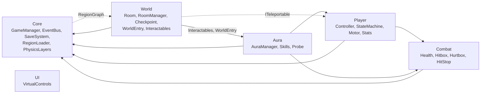

# Kiến trúc hệ thống (Aura Knight)

Mô tả những gì đã có trong code (phase 1-13 và pipeline art; boss: `Scripts/Bosses` (§13), shop/bản đồ: `Scripts/Progression`). Thiết kế: [`game-design-document.md`](game-design-document.md) §12. Quy ước: [`code-standards.md`](code-standards.md).

## 1. Bố cục scene

| Scene | Vai trò |
|-------|---------|
| `Boot` (build index 0) | `Bootstrapper`: đặt 60 fps, chặn tắt màn hình, load `MainMenu` |
| `MainMenu` | Màn hình menu (`MenuScreens`); nút chơi gọi `GameLauncher.Begin` (xem §5) |
| `Core` | Luôn được giữ khi chơi. Camera (Cinemachine + confiner) và object `Managers`: `GameManager`, `CheckpointService`, `RoomManager`, `RegionLoader`, `WorldEntry`. Player là prefab do `WorldEntry` tạo |
| `Region_Hub/Forest/Cave/City/Castle` | Mỗi vùng một scene, load/unload additive bởi `RegionLoader`. Chứa các `Room` (prefab sinh từ `Data/Levels`), `SunAltar` và `RegionLighting` (Global Light 2D của vùng). Xem §11 |
| `Test/Test_Movement`, `Test_Aura`, `Test_Rooms`, `Test_Enemies` | Scene thử độc lập, sinh bởi generator (`Test_Movement`, `Test_Aura` có `TestCheckpoint` vì hồi sinh không còn "sống lại tại chỗ") |

## 2. Bản đồ module

| Module | Nội dung chính |
|--------|----------------|
| Core | Vòng đời game (`GameManager`, `GameMode`), `GameState` + `SaveSystem` (`ISaveStorage`/`FileSaveStorage`), `EventBus` + `GameEvents`, `RegionLoader`/`SceneLoader`, `PhysicsLayers`, `Singleton`, `Haptics` |
| Player | Máy trạng thái 13 state, `KinematicMotor2D` (di chuyển động học, không dùng physics solver), `PlayerInputReader` (`IPlayerInput`), `PlayerStats` (tim, năng lượng, xu), `PlayerCombat` |
| Combat | `Health`, `Hitbox`/`Hurtbox` theo `Team`, `Knockback`, `HitStop`, i-frame, `EnergyPool` |
| Aura | `AuraManager` (Aura hiện tại, mở khóa, đổi, cast), `AuraDefinition` (SO), `PlayerAuraBinder` (passive vào Player), 3 skill, `AuraInteractionProbe` |
| World | `Room`/`RoomManager`/`RoomExit`, `RegionGraph`, `SunAltar` + `CheckpointService`, `Shortcut`, `WorldEntry`, `Interactables/*`, `Pickups/*`, `Hazards/*`, `ParallaxLayer`, `RegionLighting`, `RegionPreloadZone`, `SealGate`/`AuraSeal` (xem §11) |
| UI | Xem §5: theme, router màn hình, HUD, menu, `VirtualControls`. Chỉ nghe `EventBus` |
| Enemies | Xem §6: 4 archetype + modifier, `EnemyStats`, drop xu |
| Audio | Xem §7: `Sfx.Play`, `AudioManager`, nhạc theo vùng |

Hướng phụ thuộc:
- Tất cả phụ thuộc `Core`; `Core` chỉ biết `World` qua `RegionGraph` (dữ liệu vùng).
- Khung phòng/hồi sinh của World (`Room`, `RoomManager`, `RoomExit`, `CheckpointService`, `AltarArrival`) **không biết `Player`**: chỉ dịch chuyển nhân vật qua `ITeleportable` (`PlayerController` cài đặt).
- Ngoại lệ có chủ đích: `WorldEntry` gọi `PlayerCombat` (reset khi vào game); vài `Interactables` dùng `Aura`/`Combat` (`OxygenMeter`, `HeatVent`) hoặc `Player` (`WindCurrent`, `LavaFreezable`, `LightDropPickup`) vì chúng là cơ quan phản ứng với Leo.
- Giao tiếp ngang giữa các module qua `EventBus`, không gọi trực tiếp. Mọi code runtime nằm chung một assembly nên hướng này là quy ước, không do compiler ép.

## 3. Luồng chạy

### 3.1 Game mới / tiếp tục

1. Menu gọi `WorldEntry.StartNewGame()` hoặc `Continue()`: `GameManager` nạp/tạo `GameState`, publish `GameStateLoaded`, `GameMode = Loading`.
2. `WorldEntry` tra vùng của `lastAltarId` trong `RegionGraph.altarIds`, `RegionLoader.SetCurrentRegion` rồi chờ scene load xong và bàn thờ đăng ký (`FindAltar`). Không tìm được thì dùng bàn thờ Hub.
3. Tạo Player (hoặc dùng lại, gọi `ResetToFreshStart()`), `AltarArrival.Place` (warp + vào phòng), `GameMode = Playing`, publish `Entered`.
4. `PlayerStats`, `AuraManager`, các cổng một lần và `Shortcut` đọc lại state khi nhận `GameStateLoaded`.

### 3.2 Chuyển phòng

`RoomExit` (trigger) → `RoomManager.EnterRoom` → bật phòng mới, đổi confiner Cinemachine (giữ damping `RoomBlendTiming`), tắt phòng cũ sau cùng khoảng trễ đó → ghi `visitedRooms` → publish `RoomEntered` → `RegionLoader` dựa vào `RegionLoadPlan` load vùng kề / unload vùng xa. Mọi lần dời vị trí đi qua `RoomManager.Warp` để camera được báo.

### 3.3 Chết → hồi sinh (có thể khác vùng)

`Health.Died` → `DeadState` giữ yên và gọi `CheckpointService.Respawn()` (coroutine, cờ `respawning`) → tra `lastAltarId`, `WorldEntry.FindAltar` nạp vùng đích nếu cần → `AltarArrival.Place` (warp, vào phòng, `Room.Restart()` nếu là phòng đang đứng) → publish `PlayerRespawned` **chỉ khi đã tới nơi**. Không giải được bàn thờ thì rơi về bàn thờ Hub và thử lại mỗi 1 s; Leo vẫn ở trạng thái Dead.

### 3.4 Đổi Aura / dùng skill

- Input đọc ngay trong `AuraManager` từ `controller.Input`. `TrySwitch`/`TryCycle` bị chặn khi Dead hoặc chưa mở khóa, CD 0.3 s → ghi `GameState` → publish `AuraChanged`.
- `PlayerAuraBinder` nghe `AuraChanged`, `AuraPassiveResolver` tính lại passive (nhảy đúp, lướt, tốc độ, nhảy, bơi) và ghi vào `PlayerController`; `AuraVisuals` đổi màu/glow.
- `TryCastSkill` → kiểm tra Dead/Hurt, CD skill, trừ năng lượng qua `PlayerStats` → `skill.Cast()`. Skill chạm cơ quan bằng `AuraInteractionProbe` → `IAuraInteractable` (cổng, dung nham...).
- Mở Aura mới: `AuraManager.Unlock(id)` ghi state và lưu file ngay, rồi boss mới publish `BossDefeated`.

## 4. Giới hạn đã biết

- `WorldEntry` chưa unload vùng đang load khi bắt đầu game mới lần hai; cổng/shortcut chỉ mở thêm, không đóng lại. Luồng menu nên quay về `Core` mới.
- `PauseController` đặt `GameMode.Paused` và khôi phục về `HitStop.GameplayScale`, nhưng chưa tự pause khi app vào nền (lưu thì có: `GameManager.OnApplicationPause`, bỏ qua khi là game mới chưa lưu mà đã có save).
- Quái bị giết hồi sinh khi phòng bật lại, chưa có ledger "đã giết từ lần nghỉ cuối".
- Chưa chạy thử trên thiết bị: rung (`VibrationEffect`), `File.Replace` trên Android IL2CPP (có đường copy dự phòng).

## 5. UI (`Scripts/UI`, namespace `AuraKnight.UI`)

- Nền: `UITheme` (SO token màu/cỡ), `ThemedText/Image/AccentBar`, `UIScreen` (fade + trượt 16 px, bắt đầu inactive, `Show/Hide`), `ScreenStack` (logic thuần) + `UIRouter`, `Localization` (`Strings_vi.json`), `GameSettings` (PlayerPrefs, khóa trong `SettingsKeys`), `PauseController`.
- HUD: `HudController` chỉ hiện khi `GameMode.Playing`; các view (tim, năng lượng, xu, Aura, boss bar) nghe event. `VirtualControls` dựng bởi `VirtualControlsBuilder`.
- Luồng menu → Core: `MainMenuScreen` → (intro) → `GameLauncher.Begin(newGame)` lưu yêu cầu rồi load `Core` (single). `CoreLauncher` (trong `UI_Root` của Core) đọc yêu cầu, gọi `WorldEntry.StartNewGame()`/`Continue()`; lỗi thì quay về menu. Pause → "Về menu" lưu rồi load `MainMenu` (`GameLauncher.ReturnToMenu`).
- Prefab/scene sinh bởi `AuraKnight.Editor.UI` (asmdef riêng, `Scripts/Editor/UI`): `UiGenerator.GenerateAll` (menu `Aura/UI/Generate All`) dựng font, sprite, theme, `Hud`, `GameScreens`, `MenuScreens`, `UI_Root` trong Core, màn trong `MainMenu`.

## 6. Enemies (`Scripts/Enemies`)

- `EnemyBase` (partial) + `WalkerEnemy`, `HopperEnemy`, `FlyerEnemy`, `CrawlerEnemy` (cả zapper tĩnh); modifier `FrontShield`, `PhaseThroughWalls`, `LifeSteal`. Logic thuần: `EnemyStateMachine`, `PatrolRules`, `DiveRules`, `ZapCycle`, `DropTable`.
- Số liệu ở `EnemyStats` (SO, 8 asset trong `Data/Enemies`). Giới hạn 6 enemy/phòng (`EnemyLimits`, validator `EnemyRoomLimitValidator`).
- Quái chết vẫn active nhưng bất động; `EnemyBase.OnEnable`/`ResetEnemy()` reset toàn bộ (phòng bật lại là hồi sinh).
- Id dữ liệu/prefab khác id art ở 3 biến thể (`BugThorn`→`ThornBug`, `PatrolBot`→`PatrolRobot`, `PoisonShroom`→`MushroomHopper`). Bảng ánh xạ duy nhất: `EnemyVariants.All[*].ArtId` (generator), ghi vào `EnemyStats.artId`.
- Xu: `CoinPickup` bị hút trong 2 tile, `CoinCollector.Collect` publish `CoinsCollected`/`CoinsChanged`.

## 7. Audio (`Scripts/Audio`)

- API chung: `Sfx.Play(SfxId, Vector3?)` (không làm gì nếu chưa có `AudioManager`). `AudioManager` có pool 12 voice, throttle 40 ms/id, pitch ±5%; `SfxLibrary` (SO) map id → clip.
- `AudioEventListener` nghe `EventBus` (sát thương, chết, Aura, xu, bàn thờ...). `PlayerSfxProbe` (component trên prefab Player) phát tiếng bước chân, nhảy, đáp, lướt, vung kiếm theo state. `MusicLayerController` crossfade nhạc theo vùng (`RoomEntered`), lớp combat theo enemy gần, `PlayBoss/PlayEnding/ReleaseOverride`.
- Mixer `Master → Music/SFX/UI` do `AudioMixerWriter` ghi; âm lượng từ `settings.musicVolume/sfxVolume`. Object `Audio` nằm trong `Core.unity`.

## 8. Art pipeline (`Scripts/Editor/Art`, asmdef `AuraKnight.Editor.Art`)

- `ArtPipeline.GenerateAll` (menu `Aura/Art/Generate All`) từ PNG + `*.sheet.json` (do `tools/art/build_art.py` sinh): preset Pixel32, slice sprite (tên ổn định `<Sheet>_<Anim>_<n>`), clip, `Leo.controller`, `EnemyBase/BossBase.controller` + `<Variant>.overrideController`, rule tile, sprite atlas, `Mat_SpriteLit` (URP 2D Sprite-Lit-Default).
- Prefab dùng art: Player (`Leo_Idle_0` + Animator + `Mat_SpriteLit`), enemy (`<ArtId>_Idle_0` + override controller + `Mat_SpriteLit`). Material lit cần Light2D trong scene, không thì sprite đen (scene test có Global Light 2D).

## 9. Chuỗi generator và `RegenerateAll`

`Aura/Regenerate All` = `AuraKnight.Editor.Tools.RegenerateAll.Run` (asmdef `AuraKnight.Editor.Tools`). Thứ tự (danh sách `BuildSteps`, thêm module mới bằng cách nối một `RegenerateStep` và thêm asmdef của nó vào Tools asmdef):

1. `art`: `ArtPipeline.GenerateAll`
2. `player`: `PlayerAssetGenerator.Generate` (prefab Player dựng lại từ đầu, sau đó gọi `PlayerSfxProbeInstaller.Apply`) + `MovementTestSceneGenerator`
3. `aura`: `AuraAssetGenerator.Generate` + `AuraTestSceneGenerator`
4. `enemies`: `EnemyAssetGenerator.GenerateAll` (stats, prefab, `Test_Enemies`)
5. `audio`: `AudioAssetGenerator.GenerateAll` (mixer, library, object `Audio` trong Core, probe)
6. `world-core`: `WorldSceneGenerator.GenerateAll` (RegionGraph, template phòng, bàn thờ, `Test_Rooms`, Core; phòng khởi đầu greybox chỉ cho vùng chưa có file phòng)
7. `bosses`: `BossAssetGenerator.GenerateAll` (stats, prefab, 4 phòng boss thô)
8. `progression`: `ProgressionAssetGenerator.GenerateAll` (shop, thoại Sol, prefab `TreasureChest`/`NpcSol`)
9. `levels`: `LevelGenerator.GenerateAll` (§11: prefab bẫy, 30 phòng, hoàn thiện 4 phòng boss, bàn thờ trong RegionGraph, nội dung scene `Region_*`)
10. `map`: `RoomMapDataBuilder.RebuildAll` (dữ liệu màn bản đồ từ các phòng vừa đặt)
11. `ui`: `UiGenerator.GenerateAll`
12. `validators`: `RoomIdValidator.Validate` + `EnemyRoomLimitValidator.Validate` + `LevelGenerator.Validate` (lỗi thì ném exception)

Mỗi step lỗi sẽ log tên step rồi ném lại (batch thoát mã 1). Chạy lại cho cùng nội dung; file YAML vẫn đổi số `fileID` vì Unity gán ID ngẫu nhiên cho object tạo bằng code.

## 10. Công cụ chụp màn hình

`SceneScreenshot` (`Scripts/Editor/Tools`) render scene ở chế độ edit vào RenderTexture, ghi `Logs/screenshots/<job>_<w>x<h>.png`. Chạy `tools/unity-batch.sh shot` (không có `-nographics`, cần GPU, `SHOT_TIMEOUT` mặc định 900 s; tùy chọn `-shotScenes a.unity;b.unity -shotSizes 1920x1080,2340x1080 -shotPlayer -shotHud`). Bộ mặc định: MainMenu, Core+Region_Hub (Player tại bàn thờ + HUD), Test_Movement/Aura/Enemies ở 1920x1080, 2340x1080, 2520x1080. Canvas Overlay được đổi tạm sang Screen Space Camera và `CanvasScaler` thay bằng hệ số tương đương; ảnh trống (một màu) bị báo lỗi. Giới hạn: chỉ thấy trạng thái tĩnh (không chạy script runtime), HUD ở giá trị mặc định, Cinemachine bị tắt và camera đặt tay.

## 11. Nội dung màn chơi (`Data/Levels`, `Scripts/World/Hazards`, `Scripts/Editor/World/Levels`)

- **Nguồn sự thật:** `Assets/_Project/Data/Levels/<Vùng>/<id>.room.txt` (30 phòng; 4 phòng boss do `BossAssetGenerator` dựng rồi `BossRoomLinker` hoàn thiện). Mỗi file có phần header (`id`, `region`, `slot`, `size`, `doors`, `altar`, `ids`, `rewards`, `requires`, `preload`, `zones`) và lưới ký tự (dòng trên cùng là hàng trên cùng, y hướng lên). Ký hiệu, bản đồ và bảng phòng: [`level-map.md`](level-map.md). `RoomFileParser` kiểm mọi đầu vào của file (kích thước, ký tự, cửa, id) và ném `FormatException` nêu tên file.
- **Pipeline (`LevelGenerator.GenerateAll`):** parse + `LevelValidator.ValidateFiles` (dừng nếu lỗi) → `HazardPrefabs` (Spikes, KillZone, CollapsingPlatform, FallingStalactite, Piston, AcidPool, MovingSpikeFloor, SealGate, AuraSeal) → `RoomPrefabBuilder` mỗi phòng (khung `Room_Template`, `RoomTerrain`: tile rule của vùng + collider hộp gộp trên layer Ground, `RoomHazards`, `RoomProps`, `RoomEnemies`, `RoomLinks`: `RoomExit` + spawn `from_<phòng>`, `RoomBackdrop`: 4 lớp parallax) → `BossRoomLinker` → `WorldAssetGenerator.GenerateRegionGraph` (altar lấy từ file) → `LevelSceneBuilder` (đặt phòng theo ô lưới, `RegionLighting`).
- **Cửa và spawn:** cửa là dải chữ số ở cột trái/phải. `RoomExit` của phòng A dẫn tới B dùng spawn `from_A` của B (phòng boss chỉ có `default`). Spawn cách cửa 3 ô; validator cấm quái trong 7 cột và bẫy trong 2 ô quanh điểm đến.
- **Thành phần runtime mới (`AuraKnight.World`):** `Hazards/` (`Spikes`, `CollapsingPlatform` + `CollapseCycle`, `FallingStalactite` + `StalactiteCycle`, `Piston` + `PistonCycle`, `MovingSpikeFloor` + `PingPongPath`, `AcidPool`); hơi nóng dùng lại `HeatVent`, bẫy lửa dùng lại `ExtinguishableGate`. `ParallaxLayer` (+ `ParallaxMath`, chỉ vẽ lớp của phòng Leo đang đứng), `RegionLighting` (+ `RegionLightingTable`; mỗi scene vùng một Global Light 2D, chỉ bật khi phòng hiện tại thuộc vùng đó), `RegionPreloadZone` (phòng có lối sang nhiều vùng: `hub_03`), `SealGate` + `AuraSeal` + `SealRules`. `Player/SmoothWall` đánh dấu vách không bám được (`KinematicMotor2D.GripsWall`).
- **Gating:** vách nhẵn 6 ô ở `cave_01`, Rào Gỗ 2×5 và cổng ấn trong `hub_03`. `LevelReachability` (bộ giải lưới) chứng minh hai chiều: mô hình `Safe` (nhảy thoải mái) cho thấy đường đi tồn tại; mô hình `Max` (giới hạn vật lý + dư) cho thấy cổng không qua được khi thiếu Aura. `LevelProgression` đi thử toàn game từ bàn thờ hub tới Malakor.

## 12. Tối ưu Android và phát hành (phase 13, GDD §12.5)

- **Khung hình:** `Bootstrapper` đặt `vSyncCount = 0` (Android bỏ qua `targetFrameRate` khi bật vsync; mọi quality level cũng đã đặt vsync 0 trong `ProjectSetup`) rồi gọi `GameSettings.ApplyFrameRate()`: 60 fps, hoặc 30 fps khi `settings.powerSaving` đã lưu. Bật/tắt chế độ tiết kiệm trong Settings gọi lại hàm đó.
- **Giới hạn đèn:** `LightBudgetController` (object `Managers` trong Core, do `WorldSceneGenerator` thêm) mỗi 0.5 s tắt các Light2D cục bộ xa Leo, chỉ giữ `LightBudget.Limit` đèn gần nhất (8, hoặc 4 khi tiết kiệm). Chỉ bật lại đèn do chính nó tắt; Global Light (vùng) không bị đụng. Chưa có Shadow Caster 2D trong game (P1) nên "tắt Shadow Caster khi tiết kiệm" hiện chỉ là giảm số đèn.
- **Pool:** `FireballSkill` (6 viên), `CoinPickupPool`, và `BossHazardPool` (hazard boss có hitbox: rễ, hạt độc, sóng, hơi nóng, laser; tối đa 64 object nghỉ). Marker vô hại (`Harmless`) không pool vì `CeilingDropAttack` giữ handle qua nhiều frame. `BossHazard.Owner` ngăn boss này xóa nhầm hazard đã được boss khác tái dùng. `LightDropPickup` vẫn `Instantiate/Destroy` (rơi 10% khi quái chết, không đáng pool).
- **Atlas:** Sprite Atlas v2 `Atlas_Player` (Leo) và mỗi vùng một atlas (tileset, quái, boss), `AtlasBuilder` trong `ArtPipeline`. Không có atlas UI: UI chỉ có 6 sprite nhỏ với hai chế độ lọc (Point cho tim/xu, Bilinear cho vòng tròn) nên gộp không có lợi.
- **Âm thanh:** camera chính của Core có `AudioListener` thật (do `WorldSceneGenerator.FindOrBuildCamera` thêm); `AudioListenerGuard` trong `UI_Root` chỉ là lưới an toàn.
- **Phát hành:** `ProjectSetup` đặt `1.0.0` mã 1, Development Build tắt, vsync 0. `BuildScript.BuildDevelopmentApk` (bật Development) và `BuildReleaseApk` (từ chối, thoát mã 1, khi thiếu keystore; keystore không bao giờ nằm trong repo). Credits dựng từ ba `LICENSES.md` bởi `CreditsTextBuilder` trước mỗi build.
- **Ánh sáng Lâu Đài:** `RegionLightingTable.Castle` là 0.15 (GDD §10 ghi 0.05; ảnh runtime cho thấy 0.05 che hết bệ đứng). Xem `docs/qa/bug-log.md` BUG-001.
- **QA:** `docs/qa/` (test case, bug log, playtest M1 đến M3, checklist thiết bị).

## 13. Boss (`Scripts/Bosses`, `Scripts/Editor/Bosses`, GDD §7.4)

- **Khung:** `BossBase` (partial: Attacks/Combat/Visuals/Spawns), `BossStats` (SO trong `Data/Bosses`: id, HP, thưởng Aura, `finalBoss`, nhịp), `BossPhase` + `WeightedPicker` (chọn đòn theo trọng số, tránh lặp đòn vừa dùng), `BossAttack` trừu tượng chạy trên `BossAttackTimeline` (Telegraph/Execute/Recover; `BossTiming` giữ báo trước tối thiểu 0.5 s), `BossHazard` + `BossHazardPool` (§12), `WeakPointHurtbox` (nhân x2 mọi sát thương, BUG-004), `PlayerSlowStatus`.
- **4 boss:** `RootTree/`, `StoneSpider/`, `RogueMachine/`, `Malakor/` (mỗi thư mục: lớp boss + 3 đòn; Malakor thêm `DarkPhaseController` và `AuraColorStrikeAttack` ở phase 3, 25% HP). Số đòn và hồ đòn từng phase nằm trong `BossAttackSetup` (Editor); đổi số thì chạy lại generator, không sửa prefab.
- **`BossArena`:** trigger vào phòng đóng cửa, publish `BossEncounterStarted`/`BossHealthChanged`/`BossEncounterEnded`, đổi nhạc; `ResetEncounter()` khi `PlayerDied`. `Refresh()` đọc `GameState.defeatedBosses` khi bật và khi `GameStateLoaded`: boss đã thắng không xuất hiện lại.
- **Thứ tự chiến thắng (`BossVictorySequence`):** `UnlockReward()` (qua `IBossVictorySteps`, trả `false` nếu không cấp được Aura, khi đó dừng, boss chưa bị đánh dấu thắng) → `MarkDefeated` → `BossDefeated` (autosave) → `EndEncounter` → nhạc. Boss cuối: `PlayEnding` rồi `GameCompleted`.
- **Phòng boss:** `BossAssetGenerator` dựng prefab thô `Room_Boss_<Vùng>`; `BossRoomLinker` (step `levels`, §11) hoàn thiện (lối ra, tile, nền). Id phòng `<vùng>_boss`.

## 14. `tools/unity-batch.sh`

| Lệnh | Việc |
|------|------|
| `compile` / `setup` | Import + compile; `setup` chạy `ProjectSetup.Run` |
| `test [EditMode\|PlayMode]` | Ghi `Logs/test-results.xml`; `UNITY_TEST_FILTER` thu hẹp; `UNITY_GRAPHICS=1` bỏ `-nographics` để test chụp ảnh runtime có GPU |
| `exec Namespace.Class.Method` | Chạy hàm editor tĩnh (generator) |
| `shot [...]` | Chụp scene (§10) |

Mã thoát là mã thật của Unity (`code=$?` ngay sau lệnh chạy): `1` khi có `error CS` hoặc generator ném exception; `64` sai cú pháp; `75` Editor đang mở project. Khoá chạy tuần tự bằng thư mục `.unity-batch.lock` (reclaim khi chủ khoá đã chết). Chưa có timeout cho `compile`/`test`/`exec` (chỉ `shot` có); nếu run chết sớm, phần tóm tắt có thể in số của `Logs/test-results.xml` cũ, nên đọc log trước khi tin số.
