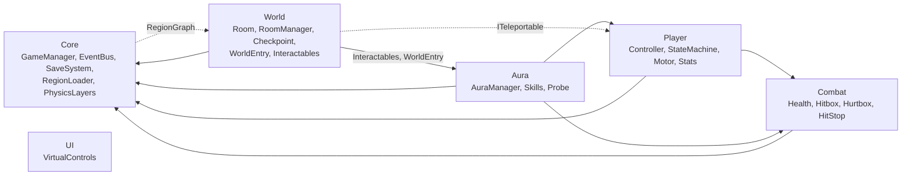

# Kiến trúc hệ thống (Aura Knight)

Mô tả những gì đã có trong code (phase 1, 3, 4, 5, 6). Enemies, Bosses, HUD/menu, Audio, Shop chưa có. Thiết kế: [`game-design-document.md`](game-design-document.md) §12. Quy ước: [`code-standards.md`](code-standards.md).

## 1. Bố cục scene

| Scene | Vai trò |
|-------|---------|
| `Boot` (build index 0) | `Bootstrapper`: đặt 60 fps, chặn tắt màn hình, load `MainMenu` |
| `MainMenu` | Chỗ gọi `WorldEntry.StartNewGame()` / `Continue()` (UI menu: phase 10) |
| `Core` | Luôn được giữ khi chơi. Camera (Cinemachine + confiner) và object `Managers`: `GameManager`, `CheckpointService`, `RoomManager`, `RegionLoader`, `WorldEntry`. Player là prefab do `WorldEntry` tạo |
| `Region_Hub/Forest/Cave/City/Castle` | Mỗi vùng một scene, load/unload additive bởi `RegionLoader`. Chứa các `Room` và `SunAltar`; hiện mới có phòng khởi đầu greybox do generator sinh |
| `Test/Test_Movement`, `Test_Aura`, `Test_Rooms` | Scene thử độc lập, sinh bởi generator (`Test_Movement`, `Test_Aura` có `TestCheckpoint` vì hồi sinh không còn "sống lại tại chỗ") |

## 2. Bản đồ module

| Module | Nội dung chính |
|--------|----------------|
| Core | Vòng đời game (`GameManager`, `GameMode`), `GameState` + `SaveSystem` (`ISaveStorage`/`FileSaveStorage`), `EventBus` + `GameEvents`, `RegionLoader`/`SceneLoader`, `PhysicsLayers`, `Singleton`, `Haptics` |
| Player | Máy trạng thái 13 state, `KinematicMotor2D` (di chuyển động học, không dùng physics solver), `PlayerInputReader` (`IPlayerInput`), `PlayerStats` (tim, năng lượng, xu), `PlayerCombat` |
| Combat | `Health`, `Hitbox`/`Hurtbox` theo `Team`, `Knockback`, `HitStop`, i-frame, `EnergyPool` |
| Aura | `AuraManager` (Aura hiện tại, mở khóa, đổi, cast), `AuraDefinition` (SO), `PlayerAuraBinder` (passive vào Player), 3 skill, `AuraInteractionProbe` |
| World | `Room`/`RoomManager`/`RoomExit`, `RegionGraph`, `SunAltar` + `CheckpointService`, `Shortcut`, `WorldEntry`, `Interactables/*`, `Pickups/*` |
| UI | `VirtualControls`: joystick động, vuốt, safe area. Không tham chiếu module nào khác trong code; chưa có HUD |

Hướng phụ thuộc:
- Tất cả phụ thuộc `Core`; `Core` chỉ biết `World` qua `RegionGraph` (dữ liệu vùng).
- Khung phòng/hồi sinh của World (`Room`, `RoomManager`, `RoomExit`, `CheckpointService`, `AltarArrival`) **không biết `Player`**: chỉ dịch chuyển nhân vật qua `ITeleportable` (`PlayerController` cài đặt).
- Ngoại lệ có chủ đích: `WorldEntry` gọi `PlayerCombat` (reset khi vào game); vài `Interactables` dùng `Aura`/`Combat` (`OxygenMeter`, `HeatVent`) hoặc `Player` (`WindCurrent`, `LavaFreezable`, `LightDropPickup`) vì chúng là cơ quan phản ứng với Leo.
- Giao tiếp ngang giữa các module qua `EventBus`, không gọi trực tiếp. Mọi code runtime nằm chung một assembly nên hướng này là quy ước, không do compiler ép.

## 3. Luồng chạy

### 3.1 Game mới / tiếp tục

1. Menu gọi `WorldEntry.StartNewGame()` hoặc `Continue()`: `GameManager` nạp/tạo `GameState`, publish `GameStateLoaded`, `GameMode = Loading`.
2. `WorldEntry` tra vùng của `lastAltarId` trong `RegionGraph.altarIds`, `RegionLoader.SetCurrentRegion` rồi chờ scene load xong và bàn thờ đăng ký (`FindAltar`). Không tìm được thì dùng bàn thờ Hub.
3. Tạo Player (hoặc dùng lại, gọi `ResetToFreshStart()`), `AltarArrival.Place` (warp + vào phòng), `GameMode = Playing`, publish `Entered`.
4. `PlayerStats`, `AuraManager`, các cổng một lần và `Shortcut` đọc lại state khi nhận `GameStateLoaded`.

### 3.2 Chuyển phòng

`RoomExit` (trigger) → `RoomManager.EnterRoom` → bật phòng mới, đổi confiner Cinemachine (giữ damping `RoomBlendTiming`), tắt phòng cũ sau cùng khoảng trễ đó → ghi `visitedRooms` → publish `RoomEntered` → `RegionLoader` dựa vào `RegionLoadPlan` load vùng kề / unload vùng xa. Mọi lần dời vị trí đi qua `RoomManager.Warp` để camera được báo.

### 3.3 Chết → hồi sinh (có thể khác vùng)

`Health.Died` → `DeadState` giữ yên và gọi `CheckpointService.Respawn()` (coroutine, cờ `respawning`) → tra `lastAltarId`, `WorldEntry.FindAltar` nạp vùng đích nếu cần → `AltarArrival.Place` (warp, vào phòng, `Room.Restart()` nếu là phòng đang đứng) → publish `PlayerRespawned` **chỉ khi đã tới nơi**. Không giải được bàn thờ thì rơi về bàn thờ Hub và thử lại mỗi 1 s; Leo vẫn ở trạng thái Dead.

### 3.4 Đổi Aura / dùng skill

- Input đọc ngay trong `AuraManager` từ `controller.Input`. `TrySwitch`/`TryCycle` bị chặn khi Dead hoặc chưa mở khóa, CD 0.3 s → ghi `GameState` → publish `AuraChanged`.
- `PlayerAuraBinder` nghe `AuraChanged`, `AuraPassiveResolver` tính lại passive (nhảy đúp, lướt, tốc độ, nhảy, bơi) và ghi vào `PlayerController`; `AuraVisuals` đổi màu/glow.
- `TryCastSkill` → kiểm tra Dead/Hurt, CD skill, trừ năng lượng qua `PlayerStats` → `skill.Cast()`. Skill chạm cơ quan bằng `AuraInteractionProbe` → `IAuraInteractable` (cổng, dung nham...).
- Mở Aura mới: `AuraManager.Unlock(id)` ghi state và lưu file ngay, rồi boss mới publish `BossDefeated`.

## 4. Giới hạn đã biết

- `WorldEntry` chưa unload vùng đang load khi bắt đầu game mới lần hai; cổng/shortcut chỉ mở thêm, không đóng lại. Luồng menu nên quay về `Core` mới.
- Pause menu tương lai phải đặt `GameMode.Paused` và khôi phục về `HitStop.GameplayScale`.
- Chưa chạy thử trên thiết bị: rung (`VibrationEffect`), `File.Replace` trên Android IL2CPP (có đường copy dự phòng).
